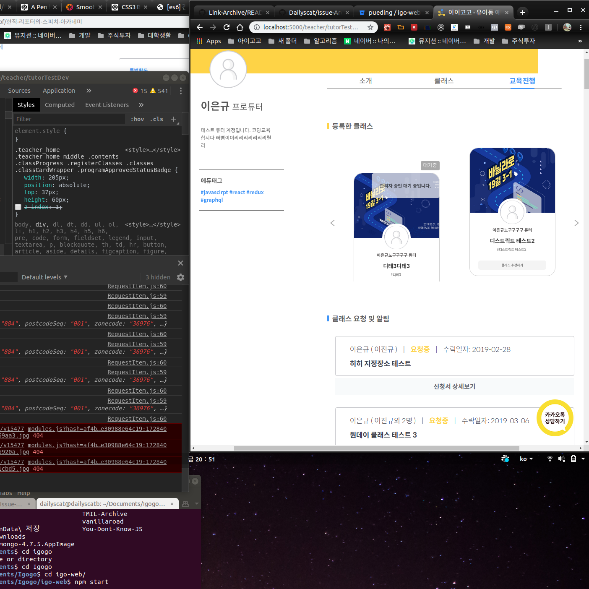

<!-- 
author: Dailyscat
purpose: issue arrange
rules:
 (1) 헤더와 문단사이 
     
     
 (2) 코드가 작성되는 부분은 >로 정리
 (3) 참조는 해당 내용 바로 아래 
     
     
 (4) 명령어는 bold
 (5) 방안은 ## 안의 과정은 ###
-->

# Issue: stacking context가 우선인가 수정이 적은 코드가 우선인가

## 상황: 

클래스 카드 위에 상태를 표현하는 요소를 올리는데 stacking context에 의해 요소를 카드 밑에 작성하고 라이브러리까지 수정하는게 맞는지, stacking context를 어기고 간단하게 작성할 수 있는 코드를 따라가는게 맞는지 고민하던 상황

 

## 생각해낸 방안:
+ stacking context를 따라서 원소를 밑에 배치
+ stacking context를 무시하고 z-index를 줘서 배치

 

## 방안: stacking context를 따라서 원소를 밑에 배치
 
  
  이 상황에서는 position에 absolute를 줘야했고, 
  carousel을 위해서 사용하고 있는 라이브러리인 react-slick의 css를 수정해야했다.

  stacking context를 따라 갔을 때 세네가지 복합적인 수정사항이 있었다.
  - 요소 위치
  - 라이브러리가 갖고 있는 기본 height 수정
  - 라이브러리가 갖고 있는 item의 margin 수정
  - 라이브러리 위치가 바뀜에 따라 전체적인 비율 조정

 
 
 

        참조:
        
 

## 방안:  (택)
 
  
  이 상황에서는 position에 absolute를 줘야했고, 
  stacking context를 어기고 z-indx 1을 주어 요소의 기본적인
  위치만 수정해주면 되었다.

  나는 이 방안을 택했는데, 이유는 css 코드자체의 판독성이 훨씬 좋다고 생각했다. 라이브러리의 css를 수정하여 의존해 있는건 나중에 봤을 때 알아보기 쉽지 않고, z-index라는 속성이 가지고 있는 의미가 명확하게 드러났기 때문에 후자를 택하여 구현하였다.
  
 
 
 

        참조:

 

