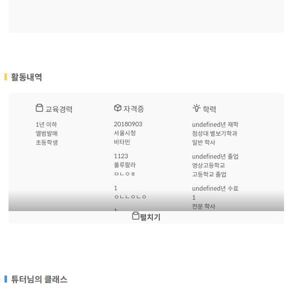

<!--
author: Dailyscat
purpose: issue arrange
rules:
 (1) 헤더와 문단사이
     
     
 (2) 코드가 작성되는 부분은 >로 정리
 (3) 참조는 해당 내용 바로 아래
     
     
 (4) 명령어는 bold
 (5) 방안은 ## 안의 과정은 ###
-->

# Issue: tutor 이력사항 ellipsis 대체 처리

## 상황:

튜터 이력사항이 길어짐에 따라 말 줄임표(...)를 사용하여 컨텐츠가 더 있고 밑에 만들어 놓은 더보기를 클릭하여 확장해야 하는 상황 하지만 각 컨텐츠가 하나의 박스로 이루어져 있었기 때문에 parent 요소에서 이를 ellipsis 등의 속성을 사용하여 말줄임표로 처리할 수 없었다.

예를들어...

 

## 생각해낸 방안:
+ 가상 클래스를 사용하여 해당 하는 각 열의 bottom에 말줄임표를 붙인다.
+ 컨텐츠가 속해있는 parent의 min-height을 주고 컨텐츠가 overflown 될 때 그 아랫 부분에 그림자를 주는데 이때 그림자에 gradient를 사용하고 그 밑 부분에 클릭했을 때 확장할 수 있는 ui 추가

 

## 방안: 가상 클래스를 사용하여 해당 하는 각 열의 bottom에 말줄임표를 붙인다. (실패)
 

    element.scrollHeight > element.clientHeight || element.scrollWidth > element.clientWidth;

  parent의 overflow를 clientHeight와 scrollHeight를 비교하여 overflow를 탐지하였다.
  후에 가상 클래스를 사용하려고 했는데 색을 바꿔보고 채도 명도를 바꿔보고 밑에 더보기 버튼도 여러가지를 바꿔보고 구상해봤는데 말줄임표가 어울리지를 않았다.

 
 
 

        참조:
        https://medium.com/@jbbpatel94/difference-between-offsetheight-clientheight-and-scrollheight-cfea5c196937

 

## 방안: 컨텐츠가 속해있는 parent의 min-height을 주고 컨텐츠가 overflown 될 때 그 아랫 부분에 그림자를 주는데 이때 그림자에 gradient를 사용하고 그 밑 부분에 클릭했을 때 확장할 수 있는 ui 추가 (성공)
 

  말줄임표는 버리고 통상적인 ui를 생각해보다가 그라데이션과 함께 overflown된 컨텐츠를 알려주는 방식이 생각나서 적용해보자고 생각했다.

  overflown은 위와 같은 방식으로 잡았고, gradient를 조금 공부해보고 가장 자연스러운 색을 찾으려고 여러가지 시도를 해보고 적용하게 됐다.

  위 그림처럼 색이 같은 div를 만들어서 컨텐츠의 parent의 밑에 붙임으로써 그라데이션이 자연스럽게 묻을 수 있도록 하고 더보기, 접기 ui기능을 추가했다.

  
 
 
 

        참조:
        linear-gradient - CSS: Cascading Style Sheets | MDN
        https://developer.mozilla.org/ko/docs/Web/CSS/linear-gradient

        background linear gradient scss expacted expression - Google 검색
        https://www.google.com/search?ei=Fg8LXaiDHpn6wAPbna7gCQ&q=background+linear+gradient+scss+expacted+expression&oq=background+linear+gradient+scss+expacted+expression&gs_l=psy-ab.3..35i304i39.22902.22902..23434...0.0..0.138.138.0j1......0....1..gws-wiz.svirvY2G9iE

        Linear-gradients do not work with html color values that include alpha · Issue #78 · ritwickdey/vscode-live-sass-compiler
        https://github.com/ritwickdey/vscode-live-sass-compiler/issues/78

        CSS3 Background Size with gradient
        https://codepen.io/machal/pen/cmpjE

        CSS Linear Gradient | CSS-Tricks
        https://css-tricks.com/snippets/css/css-linear-gradient/

        How to set bottom to top on linear-gradient? | Treehouse Community
        https://teamtreehouse.com/community/how-to-set-bottom-to-top-on-lineargradient-2

 

