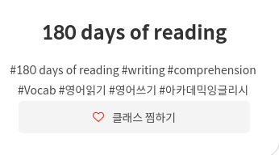

<!-- 
author: Dailyscat
purpose: issue arrange
rules:
 (1) 헤더와 문단사이 
     
     
 (2) 코드가 작성되는 부분은 >로 정리
 (3) 참조는 해당 내용 바로 아래 
     
     
 (4) 명령어는 bold
 (5) 방안은 ## 안의 과정은 ###
-->

# Issue: 클래스 카드의 태그 보안

## 상황: 

클래스 카드의 태그를 #를 사용해서 관리하는데, safari에서 wordbreak 속성이 적용되지 않았음

 

## 생각해낸 방안:
+ word-break의 pollyfill 적용
+ span으로 감싸서 처리

 

## 방안: word-break의 pollyfill 적용 (실패)
 
  
  폴리필 자체의 적용하는 것이 어려운 일은 아니었다. 하지만 #이라는 character자체가 글자로 인식이 되질 않아서 한글로 보기 좋게 속성이 적용 되질 않았다. 그래서 다른 대안으로 생각해야했다.

 
 
 

        참조: 
        https://teilar.tistory.com/entry/word-break-%EC%9D%B4%EB%9F%B0-%EB%AC%B8%EC%A0%9C%EA%B0%80
        
 

## 방안: span으로 감싸서 처리 (성공)
 
  
  고민을 하다가 애초에 요소 자체로 만들어서 width 값을 기준으로 다음 줄로 넘어가게 하는게 더 낫겠다 라고 생각했다.

  span으로 모든 태그 값을 감싸고 부모 요소에 flex를 입혀서 요소에 상관없이 중앙정렬 되도록 설정했다.

  
 
 
 

        참조:

 

