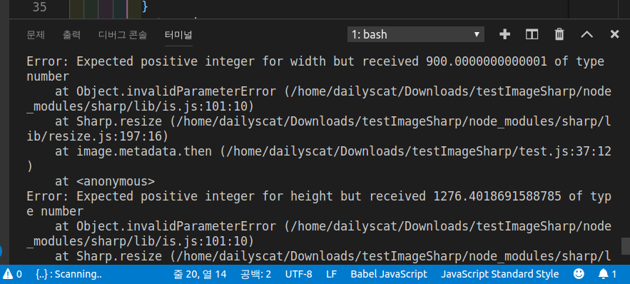

<!--
author: Dailyscat
purpose: issue arrange
rules:
 (1) 헤더와 문단사이
     
     
 (2) 코드가 작성되는 부분은 >로 정리
 (3) 참조는 해당 내용 바로 아래
     
     
 (4) 명령어는 bold
 (5) 방안은 ## 안의 과정은 ###
-->

# Issue: node.js 사용하여 로컬 폴더 내부의 이미지 리사이징 작업

## 상황:
기존 스토리지에 리사이징 되지 않고 올라간 모든 파일들을 내려 받아서 resize와 jpeg형식을 적용하여 용량을 줄이고 올려야 하는 상황

 

## 과정:
+ 모듈 찾기
+ 웹 서버를 띄우지 않고 로컬에서 리사이징 하는 방법 찾기
+ 리사이징 과정

 

## 과정1: 모듈 찾기
 
  여러 모듈을 고민했다.
  jimp, canvas, sharp 등등
  그러던 중 이 [자료](https://github.com/ivanoff/images-manipulation-performance#result-example)를 확인했고
  월등하게 빠른 시간과 issue에 대한 대응이 최근까지 있었는지 등등을 파악하고 sharp.js 선택하게 됐다.

 
 
 

        참조:
        https://github.com/ivanoff/images-manipulation-performance#result-example

 

## 과정2: 웹 서버를 띄우지 않고 로컬에서 리사이징 하는 방법 찾기
 
  보통 이미지 리사이징은 클라이언트에서 전달받은 이미지를 리사이징 하여 서버에 보내는 경우가 대다수였고,
  그 예제도 거의 로컬에 대한 과정은 없었다.

 
 

  [예제1](https://malcoded.com/posts/nodejs-image-resize-express-sharp/)

  [jimp사용예제](https://medium.com/@rossbulat/image-processing-in-nodejs-with-jimp-174f39336153)

  [예제3](https://www.nodejsera.com/resize-image-using-sharp-nodejs.html)

  어쨌든 fs를 사용해서 진행해야함을 알았고, 파일을 읽어들이는 코드부터 시작했다.

  보통 스트림을 사용하는 코드가 많았는데, 스트림에 대한 이해가 아직 확실히 안됐지만 서버와 클라이언트 사이에 작은 통로라고 이해가 됐고 그 통로를 통해 큰 파일을 작게 보냄으로써 요청과 응답의 간극을 좁힐 수가 있는 예제들을 많이 볼 수 있었다.

  [예제1](https://wedul.site/523)

  하지만 폴더 자체 내에서 작업이 필요했었기 때문에 stream을 굳이 쓸 필요가 없었기 때문에 일단 넘어갔고, 파일을 읽어 들이고, 그 파일 내용을 수정하고 다시 파일을 작성하는 흐름만을 생각하고 작성하기로 했다.

  `readdir`메소드를 쓰고 콜백으로 넘어온 단순한 filename 자체를 이용하여 `readFile`메소드의 인자로 주고 그 파일의 내용을 읽고 수정 후 `writeFileSync`로 파일을 작성하려고 했다.

    fs.readdir(dirname, function(err , filenames) {
      if (err) {
        return;
      }
      filenames.forEach(function(filename) {
        fs.readFile(dirname + "/" + filename, 'utf-8', async function(err, content) {
          if(filename.includes("jpg")){
            sharp(content).resize(300, 400).toFile("transformed.jpg").then((info) => {
              fs.writeFileSync('test1.jpg', info);
            }).catch(err=>console.log(err));
          }

          if (err) {
            return;
          }
        });
      });
    });

그런데 이 코드에서 missingInput이라는 에러가 계속 발생했다. sharp 모듈의 input이 제대로 들어가질 않았는데 가만히 보니 forEach가 다 돌고나서 readFile이 비동기로 진행이 되다보니 흔하게 for문의 스코프에서 발생하는 에러가 발생한거고 readFile에서는 읽을 input이 없었던 거였다.

다른 관점에서의 설명도 있는데 [이슈](https://github.com/lovell/sharp/issues/1794)를 첨부한다.

어쨌든 굉장히 바보같은 상태를 만들어 놓았다.

더군다나 info자체도 imageData가 아닌 metaData로 오고 있던 차라 코드 자체를 다시 쓰는게 좋다고 판단했다.

 
 
 

        참조:
        https://stackoverflow.com/questions/21253019/change-a-file-using-node-js
        https://opentutorials.org/course/3332/21122
        https://usefulangle.com/post/97/nodejs-resize-image
        https://fkkmemi.github.io/nemv/nemv-084-img-convert/
 

## 과정3: 리사이징 과정
 

    sharp('./vvvanillA.jpg')
    .resize(200)
    .jpeg()
    .toBuffer()
    .then( data => {
        fs.writeFileSync('./yellow.jpg', data);
    })
    .catch( err => {
        console.log(err);
    });

작성한 코드의 코어는 위와 같은데 작성하면서 겪은 이슈들을 정리한다.

#### (1) terminal(repl)에서 실행시 인자를 넣어서 여러 경우에 사용하도록 작성

인자를 줬을 때 어떻게 노드 스크립트에서 읽고 반영을 하는지 잘 몰랐었는데 [참조](https://stackoverflow.com/questions/4351521/how-do-i-pass-command-line-arguments-to-a-node-js-program)하여 작성했다.

`readFiles( process.argv[2], process.argv[3] );`

이 방식으로 최대넓이, 최대높이를 입력받도록 설정했다.

#### (2) __dirname의 사용법

terminal에서는 __dirname이라는 전역변수의 사용이 불가능하고 이는 무조건 script 내에서만 참조가 가능하다.
[참조](https://stackoverflow.com/questions/3133243/how-do-i-get-the-path-to-the-current-script-with-node-js)에 path를 참조할 수 있는 여러 방법들이 나와 있다.

`        const image = sharp(dirname + "/" + filename);
`

#### (3) Javascript에서 동적언어 특성에 따른 오류

위와 같은 에러가 났는데 integer(정수)가 와야하는 input인데 Number형이 온다는 에러를 읽고 있으니 왜 안되는지 한참 해매다가

코드 위에서 ratio 계산 로직이 있는데 그때의 ratio를 곱하는 과정에서 float형 으로 값이 나올 때가 있었다. 자바스크립트에서 float형 자체를 Number형으로 받아서 위 오류를 알아채는데 골치가 좀 아팠다.

`parseInt(width, 10)` 형식으로 해결.

#### (4) png로 존재하는 file들을 jpg 이름으로 저장 했을 때 기존의 png 파일 삭제하기

    if(filename.includes("png")) {
      fs.unlinkSync(dirname + "/" + filename);
    }

[참조](https://flaviocopes.com/how-to-remove-file-node/)
위 코드로 삭제하였다.

#### (5) max보다 작을 때 ratio 적용을 위해 기존 이미지의 width값을 알아야 했다.

sharp의 [metadata](https://sharp.pixelplumbing.com/en/stable/api-input/)를 이용하여 조건문을 사용하여 정해주었다.

 
 
 

        참조:
        https://www.nodejsera.com/resize-image-using-sharp-nodejs.html
        https://stackoverflow.com/questions/3133243/how-do-i-get-the-path-to-the-current-script-with-node-js
        https://sharp.pixelplumbing.com/en/stable/

 