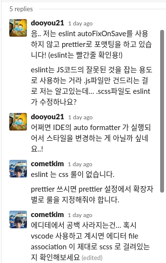

<!--
author: Dailyscat
purpose: issue arrange
rules:
 (1) 헤더와 문단사이
     
     
 (2) 코드가 작성되는 부분은 >로 정리
 (3) 참조는 해당 내용 바로 아래
     
     
 (4) 명령어는 bold
 (5) 방안은 ## 안의 과정은 ###
-->

# Issue:

eslint의 autoFixOnSave가 scss에 적용되는 오류

## 상황:

scss를 사용하는데 있어서
& > div 문법이 &>div와 같은 방식으로 autoFix가 적용되어서 공백이 다 사라지게 됩니다.
근데 이게 또 커밋이나 이대로 되면 괜찮은데, git hook을 사용해서 prettier가 적용되는 과정에서 다시 & > div와 같은 방식으로 적용이 됩니다.

와 같은 상황.
 

## 생각해낸 방안:

- eslint의 scss 침범..
- vsCode의 formatter 재설정

 

## 방안: eslint의 scss 침범.. (실패)

 
  

   
   
   

처음에는 eslint의 rule을 계속 찾아보고 있었는데,
친절한 gdg 슬랙의 고수분들의
eslint는 scss를 건드리지 않는다는 말을 듣고 잘못된 방향으로 가는 걸 파악하고 vscode의 설정을 확인하게 되었다.
 
 
 

        참조:
        gdg webtech

 

## 방안: vsCode의 formatter 재설정 (성공)

 

일단 prettier를 기본 formatter로 두고 eslint.autoSave를 끄니 귀찮은 문제는 해결이 됐다.

정확한 이유를 좀 알고 싶어서 이것저것 찾아보고 테스트를 해봤는데, 기본 formatter가 없는 경우에 원래 깔려 있었던 다른 formatter extension이 영향을 미치진 않을까 하여 확인을 해봤는데 예전에 깔아뒀던 beautify를 지워보니 위와 같은 증상이 사라졌다.

// Defines a default formatter which takes precedence over all other formatter settings. Must be the identifier of an extension contributing a formatter.

default formatter를 설정안하고 formatOnSave가 true로 되어 있을 때 이전에 존재한 formatter가 영향을 미쳐서 발생한 오류였다.

 
 
 

        참조:
          https://github.com/Microsoft/vscode/issues/41882#issuecomment-360239744

 
