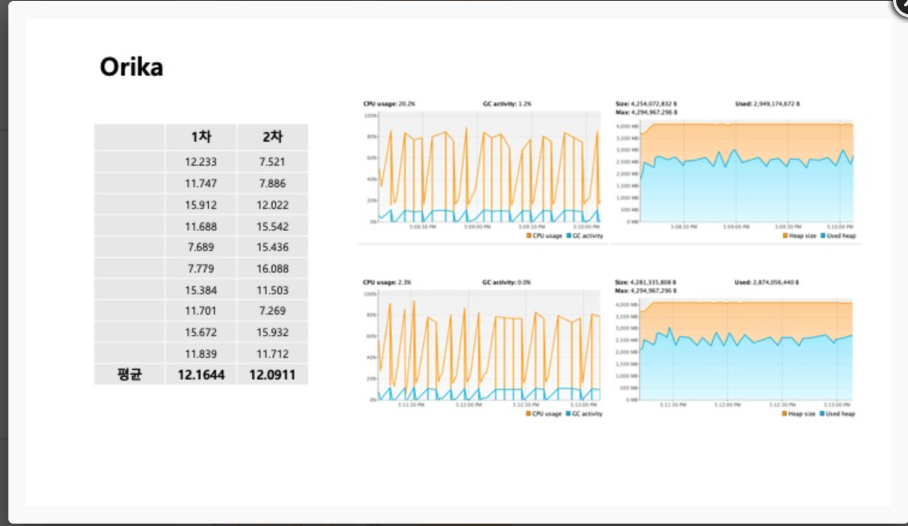
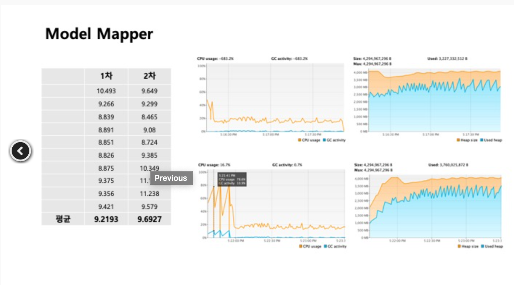
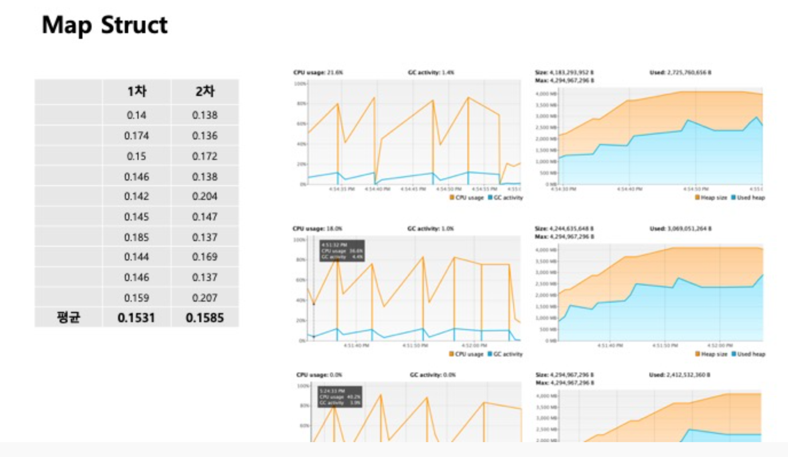

<!--
author: Dailyscat
purpose: issue arrange
rules:
 (1) 헤더와 문단사이
    <br/>
    <br/>
 (2) 코드가 작성되는 부분은 >로 정리
 (3) 참조는 해당 내용 바로 아래
    <br/>
    <br/>
 (4) 명령어는 bold
 (5) 방안은 ## 안의 과정은 ###
-->

# Issue: 2104 mapping 라이브러리 남용으로 인한 spring 백엔드에서의 memory leak

## 상황: 스프링으로 되어있는 프로젝트를 배포했을 때 cpu 사용률이 300 ~ 1000%를 치고 계속 timeout이 나는 상황

## 생각해낸 방안:

- api 요청, 응답속도 개선
- Thread Dump 확인
- MapperFactory api를 사용하는 부분에서의 문제점 개선

## 방안: api 요청, 응답속도 개선

<br/>

기존 카테고리 Api의 db를 oracle에서 mysql로 변경하는 과정에서 발생한 문제여서 일단 api의 성능부터 확인했다.

만오천건 정도의 데이터를 받아오는데에 4~5초 정도 걸리는 상황이었다. 이를 기존 api 요청 시간을 확인해서 비교해봤어야 했는데, Thread Dump를 간단하게 살펴봤을 때 timeout이 나는 부분이 가장 커서 단순하게 응답속도가 문제다라고 생각했고 시야가 좁아졌다.

여튼 기존의 카테고리를 요청할 때 restTemplate를 활용하여 한 요청씩 동기로 받아오는 부분을 mono를 사용해서 비동기로 요청을 받아오게 되었고 4,5초에서 약 3.5초 정도로 줄일 수 있었다.

```
Flux.fromIterable(levels)
			.doOnComplete(() -> log.info("Done"))
			.flatMap(body -> getCategoriesByLevel(body).onErrorResume(e -> Mono.empty()))
			.collectList();

```

<br/>
<br/>
<br/>

        참조:
        https://hijuworld.tistory.com/2

<br/>

## 방안: Thread Dump 확인

덤프뜨기

```
jstack pid > a.txt(a.txt는 원하는 파일이름쓰기)
less a.txt
/BLOCKED(후 n을 눌러서 다음 찾은 부분 확인 shift + n 눌러서 이전 부분 확인)
```

덤프를 확인해보니 blocked 되는 쓰레드가 있었고 해당 쓰레드에서 발생하는 함수를 확인했다.

```
"catalina-exec-98" #228 daemon prio=5 os_prio=0 tid=0x00007f2ec9641000 nid=0xf1c5 waiting for monitor entry [0x00007f2c150c7000]
java.lang.Thread.State: BLOCKED (on object monitor)
...
at com......CategoryConverter.convert(CategoryConverter.java:50)
```

```
원격 서버에서 scp 권한@테스트서버:/덤프 파일 위치 /내 게이트웨이의 위치
로컬에서 scp 아이디@게이트웨이:/파일위치 /로컬의 덤프 파일 위치
```

로컬 -> 게이트웨이 -> 원격서버로 되어있기 때문에 2단계를 통해 덤프를 받았다.

```

1. 로컬에서 원격으로 (Local→Remote)
> scp [전송할 파일 경로] [유저명]@[IP주소]:[받을 경로]

EX) 로컬의 /home/example.txt 파일을 원격지의 /home/test 디렉토리로 전송
> scp /home/example.txt dhj@141.211.xx.xxx:/home/test
2. 원격에서 로컬로 (Remote→Local)
> scp [유저명]@[IP주소]:[전송할 파일 경로] [받을 경로]

EX) 원격지의 /home/test.txt 파일을 로컬의 /home/example 디렉토리로 전송
> scp dhj@141.211.xx.xxx:/home/test.txt /home/example
3. 원격에서 원격으로 (Remote→Remote)
> scp [유저명]@[IP주소]:[전송할 파일 경로] [유저명]@[IP주소]:[받을 경로]

EX) A 원격지의 /home/test.txt 파일을 B 원격지의 /home/example 디렉토리로 전송
> scp dhj@141.211.xx.xxx:/home/test.txt gildong@141.223.xx.xxx:/home/example

```

<br/>

<br/>
<br/>
<br/>

        참조:
        https://doheejin.github.io/linux/2021/03/03/linux-scp.html
        https://bestugi.tistory.com/38
        https://d2.naver.com/helloworld/10963

<br/>

## 방안: MapperFactory api를 사용하는 부분에서의 문제점 개선

```
MapperFactory mapperFactory = new DefaultMapperFactory.Builder().build();
mapperFactory.classMap(Category.class, FrontCategory.class)
```

api에서 응답으로 오는 dto와 프론트에서 사용하는 vo가 달라서 매핑이 필요하여 들어있는 로직인데 기존에 위와 같이 되어 있는 부분을 아래와 같이 바꾸었다.

```
FrontCategory frontCategory = new FrontCategory();
```

처음에는 mapperFactory를 final로 convert 함수 밖에 선언하여서 해결을해야하나 생각을 했는데, 이밖에도 mapperFactory.classMap().byDefault().register() 과정에서 runtime 시점에 reflection을 통해 맵핑을 하므로 만오천건을 전부 매핑하면서 cpu 사용량을 폭발적으로 증가시킨것이었다.

api에 대해 제대로 알아보지 않고 우아하게 처리하려다보니 큰코다쳤다.

성능비교 Map Struct가 압도적으로 좋다.
MapStruct의 성능이 우수한 이유는 Lombok과 같이 annotation processor를 통해서 compile 시점에 객체간 맵핑이 이루어지기 떄문에 매우 월등한 성능을 보일 수 있다.





reflection의 주의사항 및 단점.

Performance의 오버헤드 : Reflection에는 동적으로 해석되는 유형이 포함되므로, 특정 JVM 최적화를 수행할 수 없습니다. 따라서 Reflection 작업이 비 Reflection 작업보다 성능이 떨어지며, 성능에 민감한 애플리케이션에서 자주 호출되는 코드엔 사용하지 않아야 합니다.

<br/>

<br/>
<br/>
<br/>

        참조:
        https://stackoverflow.com/questions/8354412/do-java-finals-help-the-compiler-create-more-efficient-bytecode
        https://stackoverflow.com/questions/4279420/does-use-of-final-keyword-in-java-improve-the-performance
        https://better-dev.netlify.app/java/2020/10/26/compare_objectmapper/
        https://12bme.tistory.com/94
        https://gyrfalcon.tistory.com/entry/Java-Reflection
        https://medium.com/msolo021015/%EC%9E%90%EB%B0%94-reflection%EC%9D%B4%EB%9E%80-ee71caf7eec5
        https://brunch.co.kr/@kd4/8
        http://honeymon.io/tech/2019/05/30/java-memory-leak-analysis.html
        https://woowabros.github.io/tools/2019/05/24/jvm_memory_leak.html

<br/>
