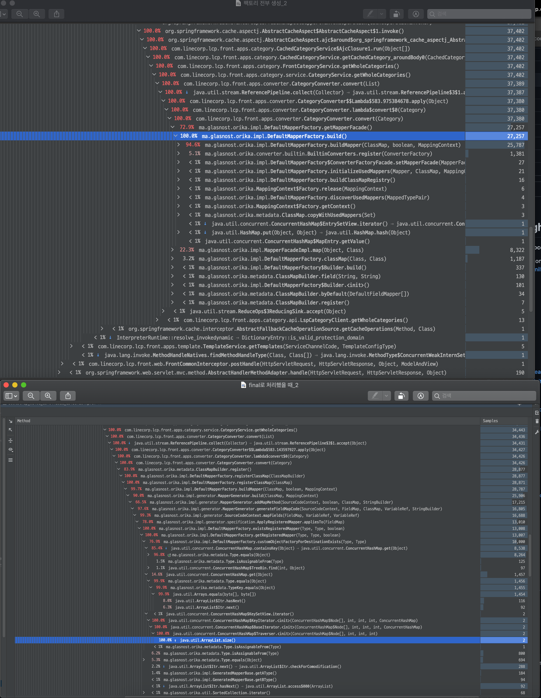
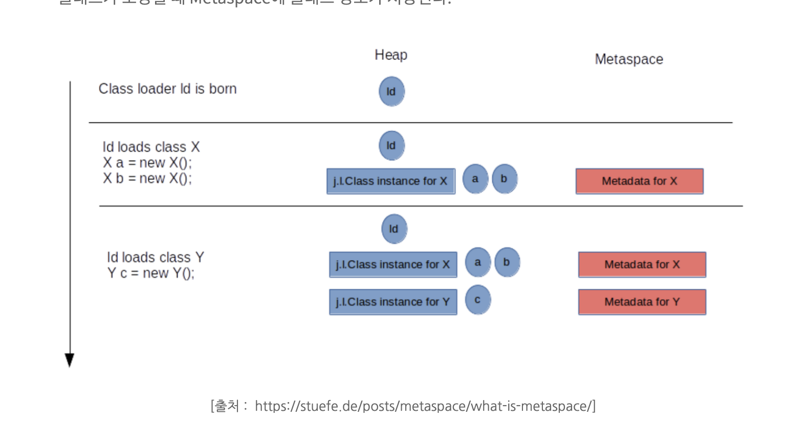

<!--
author: Dailyscat
purpose: issue arrange
rules:
 (1) 헤더와 문단사이
     
     
 (2) 코드가 작성되는 부분은 >로 정리
 (3) 참조는 해당 내용 바로 아래
     
     
 (4) 명령어는 bold
 (5) 방안은 ## 안의 과정은 ###
-->

# Issue: reflection과 metaspace(permgen) 관련 정리

 

## 알게된 부분 정리:

- 샘플링이란?
- reflection 개념
- metaspace에 저장되는 것들

 

## 개념: 샘플링이란?

 

CPU 샘플링은 프로그램 속도를 현저하게 저하시키지 않고 설정된 간격으로 실행중인 항목의 스냅 샷을 만든다. visual vm, intelliJ 프로파일러로는 1ms를 기준으로 설정하여 분석할 수 있었다.

intellij의 Flame Graph 부분에서 cpu 시간을 가장 많이 사용하고 있는지를 확인할 수 있다.
 

또한 Call Tree에서 가장 많은 cpu 시간을 사용한 메소드를 확인할 수 있고 해당 메소드의 하위 메소드를 타고타고 내려가서 파악이 가능하다.

 
 
 

        참조:
        https://devblogs.microsoft.com/devops/how-cpu-sampling-works/
        https://www.jetbrains.com/help/idea/read-the-profiling-report.html#profiler-flame-chart

 

## 개념: reflection 개념

 

runtime 시에 동적으로 클래스 정보를 얻는 api 라고 지칭할 수 있다.

reflection이 이루어질 때 metaspace(native memory)에서 정보를 읽어오기 때문에 이로인한 오버헤드가 발생한다. 그래서 내부적으로 Reflection 기능을 자주 사용할 경우 이 영역에 대한 고려가 필요.

    How does Orika perform the actual mapping

    Orika uses reflection to investigate the metadata of the objects to be mapped and then generates byte-code at runtime which is used to map those classes. This means that although some initial overhead is incurred to investigate the types and generate the mappers, the overall runtime performance is comparable to mapping by hand.

 
 
 

        참조:
        https://orika-mapper.github.io/orika-docs/faq.html

 

## 개념: metaspace에 저장되는 것들

 

jdk8 이전에 permgen 영역을 대체하는것으로 원래 permgen 영역은 heap 메모리 영역에 있었지만 metaspace는 native memory로 os가 관리하는 점이 다르다.

클래스는 최초에 모두 로딩되지 않고 필요시점에 로딩되며 클래스가 로딩될 때 Metaspace에 클래스 정보가 저장된다.

 
 
 

        참조:
        https://sheerheart.tistory.com/entry/Java-Metaspace%EC%97%90-%EB%8C%80%ED%95%B4%EC%84%9C
        https://jobc.tistory.com/205
        https://johngrib.github.io/wiki/java8-why-permgen-removed/
 
