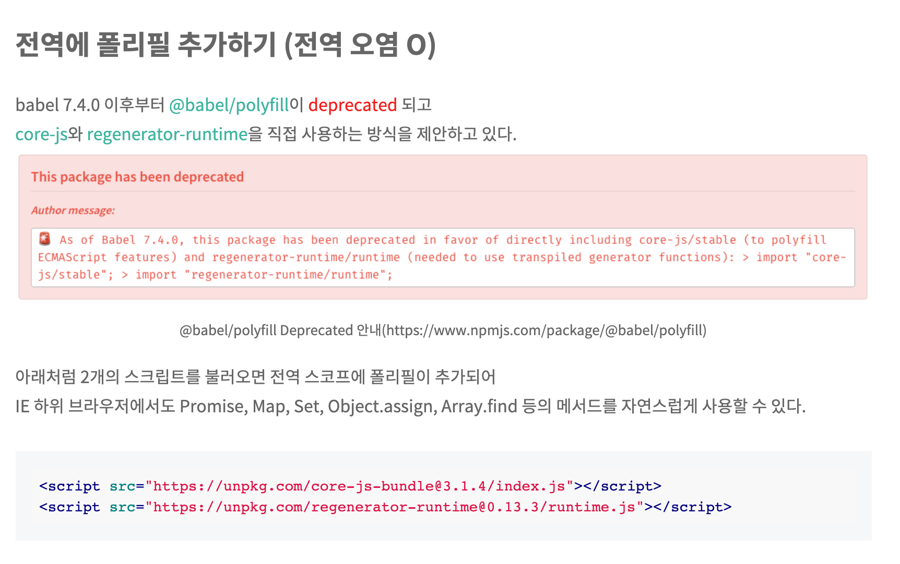
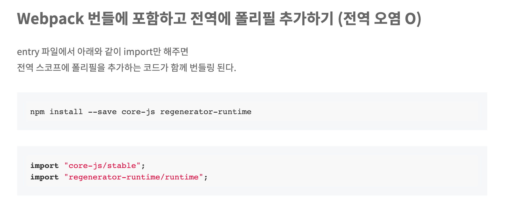
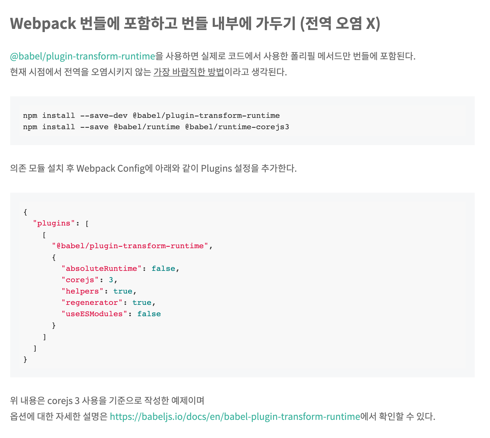

<!--
author: Dailyscat
purpose: issue arrange
rules:
 (1) 헤더와 문단사이
    <br/>
    <br/>
 (2) 코드가 작성되는 부분은 >로 정리
 (3) 참조는 해당 내용 바로 아래
    <br/>
    <br/>
 (4) 명령어는 bold
 (5) 방안은 ## 안의 과정은 ###
-->

# Issue: 자체 제작 라이브러리 번들 사이즈 줄이기

## 상황:

크롬에서 iframe 내부에서 modal, confirm을 사용하지 못하게 하는 정책이 조만간 적용된다는 얘기가 있어서 급하게 대체 alert, confirm 제작이 필요한 상황

## 생각해낸 방안:

- jss default preset을 제거하고 필요한 부분만 plugin으로 적용
- babel.rc, webpack 설정 변경하여 번들 사이즈 줄이기

## 방안: 번들 사이즈 줄이기

제공하는 파일을 하나 줄이고 싶기도 했고,
global style을 오염시키고 싶지 않아서 css in js 패러다임 중 하나인 JSS를 사용했다.

아래 처럼 사용하는게 보통인데

```
import preset from 'jss-preset-default'
import jss from 'jss'

jss.setup(preset())
```

번들사이즈를 조금이라도 더 줄이려고 아래처럼 사용했다.
임포트 하는 순서가 중요하다고 공식문서에 써있어서 조금 신경을 쓰게 됐었고
실제로 10kb정도 감소됐다.

```
import jss from "jss";
import cache from "jss-plugin-cache";
import extend from "jss-plugin-extend";
import nested from "jss-plugin-nested";
import compose from "jss-plugin-compose";
import camelCase from "jss-plugin-camel-case";
import defaultUnit from "jss-plugin-default-unit";
import expand from "jss-plugin-expand";
import vendorPrefixer from "jss-plugin-vendor-prefixer";
import propsSort from "jss-plugin-props-sort";

jss.use(cache(), extend(), nested(), compose(), camelCase(), defaultUnit(), expand(), vendorPrefixer(), propsSort());

```

plguin을 하나하나 살펴보면서 문법을 익히는게 좀 더 유익했다.

css in js 장점

```
https://d0gf00t.tistory.com/22
-컴포넌트로 생각하기— 더이상 스타일시트의 묶음을 유지보수 할 필요가 없습니다. CSS-in-JS는 CSS 모델을 문서 레벨이 아니라 컴포넌트 레벨로 추상화합니다(모듈성).
-CSS-in-JS는 JavaScript 환경을 최대한 활용하여 CSS를 향상시킵니다.
-"진정한 분리 법칙"—스코프가 있는 선택자로는 충분하지 않습니다. CSS에는 명시적으로 정의 하지 않은 경우, 부모 요소에서 자동으로 상속되는 속성이 있습니다. jss-isolate 플러그인 덕분에 JSS 규칙은 부모 요소의 속성을 상속하지 않습니다.
-스코프가 있는 선택자—CSS는 하나의 전역 네임스페이스만 있습니다. 복잡한 애플리케이션 내에서 선택자 충돌을 피할 수 없습니다. BEM과 같은 네이밍 컨벤션은 한 프로젝트 내에서는 도움이 되지만, 서드파티 코드를 통합할 때는 도움이 되지 않습니다. JSS는 JSON으로 표현된 것을 CSS로 컴파일 할 때, 기본적으로 고유한 이름을 생성합니다.
-벤더 프리픽스—생성된 CSS 규칙은 자동적으로 벤더 프리픽스가 붙어있으므로 생각할 필요가 없습니다.
-코드 공유—JavaScript와 CSS사이에 상수와 함수를 쉽게 공유할 수 있습니다.
-현재 화면에 사용중인 스타일만 DOM에 있습니다(react-jss).
-죽은 코드 제거
CSS 유닛 테스트!
```

<br/>

<br/>
<br/>
<br/>

        참조:
        https://cssinjs.org/jss-api/?v=v10.6.0
        https://cssinjs.org/jss-plugin-rule-value-function?v=v10.6.0
        https://codesandbox.io/s/z21lpmvv33?file=/index.js:87-421
        https://stackoverflow.com/questions/51654777/how-to-implement-css-nested-rules-in-jss //중첩 css 사용법
        https://bundlephobia.com/result?p=lcp-common-window-dialog@1.3.0 //번들사이즈 확인
        https://cssinjs.org/performance/?v=v10.6.0 //jss 장점
        https://blog.zhen-zhang.com/2019/09/21/computaton-talk.html //증분 빌드에 대한 설명

<br/>

## 방안: babel.rc, webpack 설정 변경하여 번들 사이즈 줄이기

```
{
  "env": {
    "development": {
      "presets": ["@babel/preset-env"],
      "plugins": []
    },
    "production": {
      "presets": [
        [
          "@babel/preset-env",
          {
            "target": { "ie": 11 }
          }
        ]
      ],
      "plugins": [["@babel/plugin-transform-runtime", { "corejs": 3 }]]
    }
  }
}
```

```
@babel/preset-env { useBuiltIns: “entry”, corejs: 3 }

- 폴리필 메서드들을 전역 스코프에 추가한다.

- deprecated 된 @babel/polyfill을 대체한다.

- 전역 오염 O


@babel/preset-env { useBuiltIns: “usage”, corejs: 3 }

- 사용된 폴리필 메서드만 전역 스코프에 추가한다.

- 전역 오염 O


@babel/plugin-transform-runtime { corejs: 3 }

- 사용된 폴리필 메서드만 포함시키고, 해당 폴리필 메서드를 사용하도록 원본 코드를 변경한다.

- 전역 오염 X
```





<br/>

<br/>
<br/>
<br/>

        참조:
        https://hacks.mozilla.org/2015/08/es6-in-depth-subclassing/ // class 문법에 대한 설명
        https://github.com/terser/terser#compress-options // webpack terser plugin
        https://okchangwon.tistory.com/4
        https://tech.kakao.com/2020/12/01/frontend-growth-02/

<br/>
