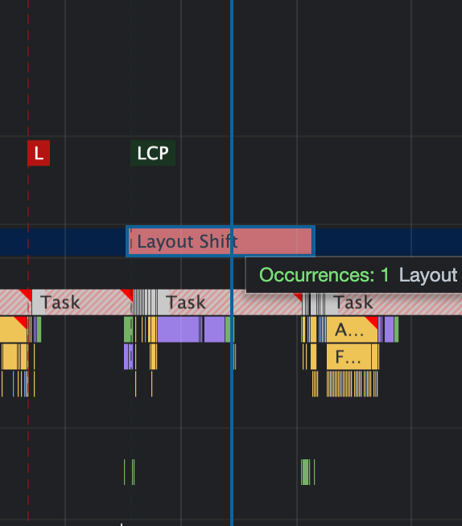

<!--
author: Dailyscat
purpose: issue arrange
rules:
 (1) 헤더와 문단사이
     
     
 (2) 코드가 작성되는 부분은 >로 정리
 (3) 참조는 해당 내용 바로 아래
     
     
 (4) 명령어는 bold
 (5) 방안은 ## 안의 과정은 ###
-->

# Issue: cls란?

## 상황:

현재 라인 인앱브라우져에서 어쩔 수 없이 cls가 발생할 수 밖에 없는 지점이 있는데 cls가 발생하며 reflow가 발생하고 이때 gif 파일은 계속해서 repaint를 하다보니
droped frame이 계속 발생하여 noise를 발생시키는걸로 보였다.
여기서 CLS라는 용어를 읽게 되어서 정리

 

## 알게된 부분 정리:

- cls란?
- session window란?
-
-

 

## 개념: cls란?

 
  Cumulative Layout Shift(누적 레이아웃 변화) 사이트의 느린 속도 또는 비동기 로딩으로 인해 레이아웃이 변화하여 사용자의 UX에 안좋은 영향을 미치는 지를 측정하는 수치이다.
  이때 레이아웃의 급격한 변화(A burst of layout shifts)는 페이지가 렌더링 되는 기간 내 5초 중 1초 미만에서 급격하게 많이 발생되었을 때를 얘기하는데 이때 CLS에 중대한 영향을 끼치게 된다.

 
 
 

        참조:
        https://web.dev/cls/?utm_source=devtools

 

## 개념: session window란?

 
  layout shift가 일어나고 그 다음 변화가 일어나기 직전까지의 순간을 session window라고 하는데 이때 cls의 측정을 최대한 정확히하기위해 최대 session window의 수는 정해져 있다(평균의 오류를 막기위해)
 
 
 

        참조:
        https://web.dev/evolving-cls/#why-a-session-window
        https://web.dev/better-layout-shift-metric/#windowing-strategies
        https://web.dev/cls-web-tooling/

 

## 개념:

 
  개념에 대한 내용
 
 
 

        참조:

 

## 개념:

 
  개념에 대한 내용
 
 
 

        참조:

 
