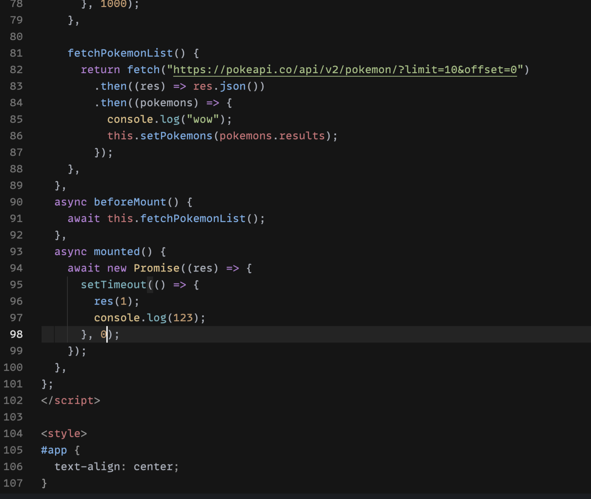
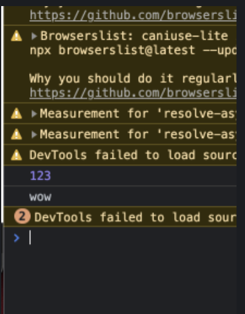

<!--
author: Dailyscat
purpose: issue arrange
rules:
 (1) 헤더와 문단사이
     
     
 (2) 코드가 작성되는 부분은 >로 정리
 (3) 참조는 해당 내용 바로 아래
     
     
 (4) 명령어는 bold
 (5) 방안은 ## 안의 과정은 ###
-->

# Issue: vue 라이프사이클에 async 적용했을 때 순서보장되지 않는 이슈

## 상황: 
beforeMount에서 data fetch가 일어나고 해당 요청의 결과로 다음 라이프사이클에서 판가름 해야할 상태가 있었는데
순서가 보장되지 않음.

## 생각해낸 방안:

- async await 적용

## 방안: async await 적용

 

해도 순서가 보장되지 않음

아래는 테스트

 
 
 

        참조:

 
