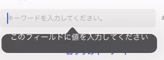

<!--
author: Dailyscat
purpose: issue arrange
rules:
 (1) 헤더와 문단사이
     
     
 (2) 코드가 작성되는 부분은 >로 정리
 (3) 참조는 해당 내용 바로 아래
     
     
 (4) 명령어는 bold
 (5) 방안은 ## 안의 과정은 ###
-->

# Issue: ios 13~ form>input에서 툴팁 발생 이슈

## 상황:
iphone 11 promax에서 input창을 클릭했을 때 툴팁이 발생하는데 정확하지 않은 정렬을 갖고 있는 채로 나온다.

## 생각해낸 방안:

- form 태그의 novalidate 속성 삽입, input에 appearance: none; css 추가

## 방안: form 태그의 novalidate 속성 삽입, input에 appearance: none; css 추가

해당 방법으로 해결

 

 
 
 

        참조:

 
