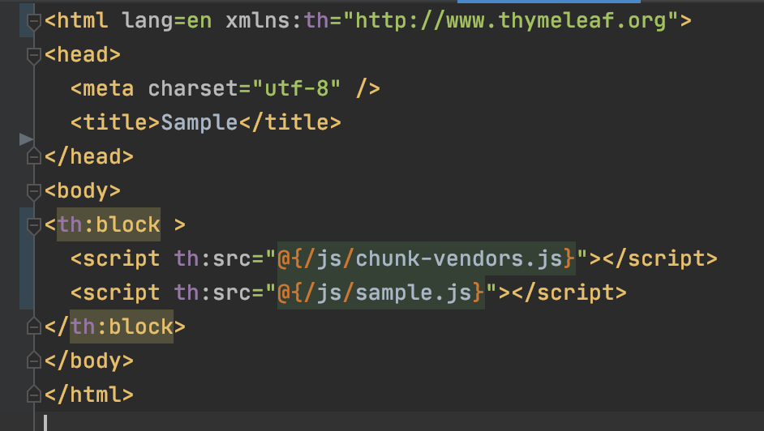
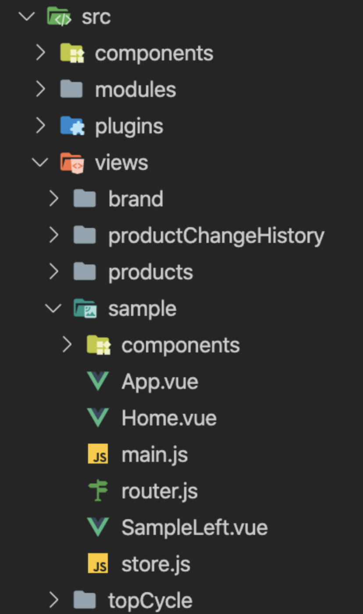

<!--
author: Dailyscat
purpose: issue arrange
rules:
 (1) 헤더와 문단사이
    <br/>
    <br/>
 (2) 코드가 작성되는 부분은 >로 정리
 (3) 참조는 해당 내용 바로 아래
    <br/>
    <br/>
 (4) 명령어는 bold
 (5) 방안은 ## 안의 과정은 ###
-->

# Issue: vue cli service에서 사용되는 webpack에서 split chunk가 설정대로 안되는 상황

## 상황: 
vue cli service의 vue.config.js에서 vendor, vendors chunk cache만 설정해놓고 여러개의 엔트리 포인트와 함께 vendors 청크만 html에 script로 설정해 놓고 사용하는 프로젝트. 


해당 프로젝트에서 공통으로 쓰는 모듈이 추가 되면 갑자기 화면이 뜨지 않음. 어떤 로그도 발생하지 않음.

## 생각해낸 방안:

- 프로젝트 구조상, root directory에서 모듈이 추가되면 상황이 해결되지 않을까?(실패)
- vue cli service에서 내가 모르는 무언가를 한다.
- webpack 내부 코드에서 분리되는 시점 살펴보기
- chunk-common에 명시적인 설정 주기

## 방안: 프로젝트 구조상, root directory에서 모듈이 추가되면 상황이 해결되지 않을까?(실패)


해당 프로젝트 구조에서 처음에는 component/ 에 모듈을 추가해서 사용하면 화면이 보여서 구조상의 위치가 문제인가 생각했다.

그래서 webpack 내부에서 모듈이 어떻게 만들어지는지를 파악하고 /src/component/ 내부의 모듈과 /src/views/엔트리포인트 directory/component/ 내부 모듈의 차이를 확인해봤다. 하지만 issuer의 차이만 있을뿐 둘이 모듈 자체에 둘의 차이가 확연하게 보이는 부분은 없었다.

여기저기 물어봤지만 vue cli service를 사용하면서 그 내부의 webpack을 사용하고 그 webpack을 사용하기 위해선 webpack-chain을 사용하고 있어서 webpack과 webpack-chain 메인 테이너에게 둘다 물어봤지만 매몰차게 거절당했다. webpack은 5가 메인일 뿐더러 vue-cli와 같이 사용하고 있으니 안되고 webpack-chain은 vue-cli 가 더 질문하기에 더 적당할 부분이라고... 둘다 말은 된다ㅠㅠ 하지만 vue 커뮤니티는 qna 세션을 굉장히 불편하게 만들어놨고 들어가봐도 질문에 답변하는 경우가 굉장히 적었다. 이때 커뮤니티의 중요성을 좀 깨닫기도.. 
https://github.com/webpack/webpack/discussions/14647
https://github.com/neutrinojs/webpack-chain/issues/319

<br/>

<br/>
<br/>
<br/>

        참조:

<br/>

## 방안: vue-cli-service에서 내가 모르는 무언가를 한다.

좀 더 확인해보다가 chunk-common이라는 청크가 만들어지는걸 확인했다. 이는 내 config에는 없는 chunk인걸 확인하고 바로 runtime을 확인해보니 chunk-common을 참조하고 있는걸 확인했다.


이게 대체 어디서 만들어지는지 모르겠어서 확인을 했다. 처음엔 webpack default인가 해서 webpack 내부를 보다가 전혀 없어서 vue cli 코드를 확인해보니 해당 코드에서 common이라는걸 주입해주고 있었다.
 https://github.com/vuejs/vue-cli/blob/0817e6dab037e063937624074e8615b98b292466/packages/%40vue/cli-service/lib/config/app.js#L28

결론적으로 chunk-common이라는 청크가 필요한데 thymeleaf에다 청크를 지정해서 사용하고 있는 현재 구조에서 chunk-common이라는 번들이 없었기 때문에 화면이 뜨지 않았던 것이었다.

근데 여기서 문제는 chunk-common이 만들어지는 시기였다. 몇번의 테스트에서 최상단 src/component에 만든 컴포넌트를 사용하면 화면이 떴었었고 또 어떤 때는 되고 어떤때는 안되서 이 근본적인 문제의 원인을 알아야 완벽하게 컨트롤 할 수 있을거라고 생각했다.

<br/>

<br/>
<br/>
<br/>

        참조:
        https://cli.vuejs.org/guide/webpack.html#modifying-options-of-a-loader

<br/>

## 방안: webpack 내부 코드에서 분리되는 시점 살펴보기

일단 웹팩은 compilation의 seal 단계의 optimizeChunksAdvanced hook을 호출하면서 사용자의 설정에 따라 코드를 분리하게 된다. split chunk plugin의 apply가 호출되고 미리 준비된 entrypoint와 사용자의 설정에 있는 cacheGroups를 가져와서 청크를 만들 준비를 한다.
이 과정에서 

webpack은 기본적으로 최소 청크사이즈를 제한한다.
https://github.com/webpack/webpack/blob/3956274f1eada621e105208dcab4608883cdfdb2/lib/WebpackOptionsDefaulter.js#L231

webpack은 최소 청크사이즈를 만족시키지 않으면 청크를 만들지 않는다.
https://github.com/webpack/webpack/blob/3956274f1eada621e105208dcab4608883cdfdb2/lib/optimize/SplitChunksPlugin.js#L873

여기서 청크 사이즈 제한이 이번 문제의 핵심이었다. 
```
    common: {
        name: `chunk-common`,
        minChunks: 2,
        priority: -20,
        chunks: 'initial',
        reuseExistingChunk: true
    }
```

해당 설정에서 minChunks: 2는 `해당 모듈을 타 청크에서 두번이상 사용할 시에 그 모듈을 common이라는 청크에 저장하여 같이 사용하도록 한다` 를 의미한다.

이렇게 두번 사용되는 모듈들은 전부 chunk-common에 포함되게 되는데 이때 포함된 모듈들의 사이즈가 전부 합쳐서 30000byte(30kb)를 넘어야 chunk-common이 만들어진다.

이 조건 때문에 현재 프로젝트에서 됐다가 안됐다가 하는 문제가 발생한 것이다. 두 청크 이상에서 사용하는 모듈들의 사이즈가 30kb를 넘지 않다가 넘어버려서 chunk-common이 만들어진거고 이를 포함하지 않은 thymeleaf 템플릿이 참조해야하는 청크가 없으니 화면을 그리지 않은거다.
또한 src/component에 모듈을 추가하여 사용했을 때는 추가한 모듈을 사용하는 곳이 한곳 뿐이니 chunk-common에 들어가지 않는다. 그렇기 때문에 chunk-common이 만들어지지 않았고 화면이 떴던 것이다. 이는 vue 인스턴스에만 해당하는 것이 아니고 util 함수를 공통으로 쓸 때도 마찬가지로 작용하게 된다.


<br/>

<br/>
<br/>
<br/>

        참조:
        https://github.com/webpack/webpack/issues/9726
        https://github.com/webpack/webpack/issues/7556
        https://github.com/timneutkens/webpack-instantiation-issue/blob/master/webpack4/webpack.config.js
        https://webpack.js.org/plugins/split-chunks-plugin/#splitchunksusedexports
        https://webpack.kr/configuration/optimization/#optimizationruntimechunk
        https://webpack.kr/configuration/optimization/#optimizationruntimechunk
        https://webpack.kr/concepts/manifest/
        https://webpack.js.org/plugins/split-chunks-plugin/#splitchunkscachegroupscachegroupreuseexistingchunk
        https://github.com/webpack/webpack/issues/7230
        https://github.com/lencioni/webpack-splitchunks-playground/pull/1
        https://github.com/carloluis/webpack-splitchunks-playground
        https://stackoverflow.com/questions/49163684/how-to-configure-webpack-4-to-prevent-chunks-from-list-of-entry-points-appearing
        https://stackoverflow.com/questions/54439646/webpack-splitchunks-plugin-why-does-setting-a-priority-of-a-chunk-make-its-ini
        https://github.com/webpack/webpack.js.org/issues/2122

<br/>

## 방안: chunk-common에 명시적인 설정 주기

원인을 알았고 해결방안은 여러가지다.

1. 각 thymeleaf 템플릿에 chunk-common을 추가한다.
가장 빠른 방법이고 명확하지만, 현재 구조에서 chunk-common이 만들어지는 것 자체가 비효율적이다.
chunk-common에는 현재 엔트리 포인트에서 생성된 청크가 아닌 다른 엔트리포인트 청크들에서 두번 이상 사용되는 모듈들이 추가되어 있다. 이는 즉 쓸데없는 코드들도 압축을 풀고 파싱해야한다는 말과 같으며 현재 페이지에서 사용하지 않는 코드들만 있는 경우도 생긴다.

2. vue.config.js에 chunk-common에 대한 명시적인 설정을 준다.
현재 구조에서 제일 효율적인 방법이다.
vue-cli의 입장에서, spa의 관점에서 common 청크의 역할은 절대적이다. 공통으로 사용되는 모듈들을 하나의 청크에 모아두고 한번만 압축, 파싱하여 브라우저에서 가지고 있고 페이지가 spa 라우터를 통해서 변경될 때만 필요한 청크를 추가적으로 불러오되 해당 청크에서 사용되는 공통 모듈은 이미 가지고 있기 때문에 효율적이다.
다만 현재 프로젝트의 경우 thymeleaf에서 페이지마다 렌더링을 해서 각 엔트리 청크들을 때에 따라 파싱하여 사용하기 때문에 이 common 청크의 역할이 비효율적이다.
하여 현재 작업자, 추후의 다음 작업자도 이해할 수 있도록 명시적으로 chunk-common에 관한 설정을 준다. vue-cli에서 chunk-common 설정을 merge 할 때 사용자의 설정의 우선순위가 더 높다. 때문에 사용자의 설정에서 chunk-common을 설정하여 chunk-common이 만들어지지 않도록 한다.

```
    common: {
    name: `chunk-common`,
    test: /[\\/]don't_need_chunk-common[\\/]/,
    minChunks: 100000,
    priority: -20,
    reuseExistingChunk: false
    },
```

<br/>

<br/>
<br/>
<br/>

        참조:
        https://stackoverflow.com/questions/52120336/what-are-the-point-of-webpack-runtime-files
<br/>
