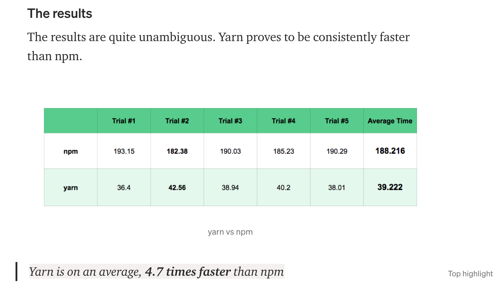

<!--
author: Dailyscat
purpose: issue arrange
rules:
 (1) 헤더와 문단사이
    <br/>
    <br/>
 (2) 코드가 작성되는 부분은 >로 정리
 (3) 참조는 해당 내용 바로 아래
    <br/>
    <br/>
 (4) 명령어는 bold
 (5) 방안은 ## 안의 과정은 ###
-->

# Issue: yarn berry 관련 정리

## 상황: 마이그레이션을 위해 공부하던 부분 정리

<br/>

## 알게된 부분 정리:

- intellij에서 .cache 에 있는 zip 파일 쓸 때 좋은 플러그인
- yarn은 현재에 정말 npm보다 좋은가? 
- 

<br/>

## 개념: intellij에서 .cache 에 있는 zip 파일 쓸 때 좋은 플러그인

<br/>
zip 파일 내부 확인가능.

https://plugins.jetbrains.com/plugin/9491-archive-browser
<br/>
<br/>
<br/>

        참조:

<br/>

## 개념: yarn은 현재에 정말 npm보다 좋은가? 

<br/>

  - 전역 캐시를 활용하여 offline mirroring 가능
    - 이는 사라진 패키지로 인한 불상사를 겪지 않게 된다.
  - yarn은 병렬 리소스 사용을 통해 확실히 빠른 속도를 보장한다(설치)
  
  
  - Flat mode 설치를 통해 중복 버전 설치를 제한한다.
  
  - using checksum to verify the integrity of every package and the ability to check licenses of your installed packages.

  ```
  If throw (the default), Yarn will throw an exception on yarn install if it detects that a package doesn't match the checksum stored within the lockfile. If update, the lockfile checksum will be updated to match the new value. If ignore, the checksum check will not happen.
        checksumBehavior: "throw"
  ```

  - 


<br/>
<br/>
<br/>

        참조:
        https://medium.com/zero-equals-false/facebooks-yarn-vs-npm-is-yarn-really-better-1890b3ea6515
        https://www.whitesourcesoftware.com/free-developer-tools/blog/npm-vs-yarn-which-should-you-choose/#Comparing_Yarn_vs_npm_similarities_and_differences

<br/>

## 개념:

<br/>
  개념에 대한 내용
<br/>
<br/>
<br/>

        참조:

<br/>

## 개념:

<br/>
  개념에 대한 내용
<br/>
<br/>
<br/>

        참조:

<br/>

## 개념:

<br/>
  개념에 대한 내용
<br/>
<br/>
<br/>

        참조:

<br/>

## 개념:

<br/>
  개념에 대한 내용
<br/>
<br/>
<br/>

        참조:

<br/>
