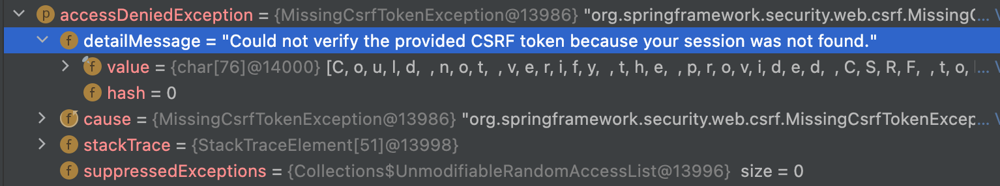

<!--
author: Dailyscat
purpose: issue arrange
rules:
 (1) 헤더와 문단사이
    <br/>
    <br/>
 (2) 코드가 작성되는 부분은 >로 정리
 (3) 참조는 해당 내용 바로 아래
    <br/>
    <br/>
 (4) 명령어는 bold
 (5) 방안은 ## 안의 과정은 ###
-->

# Issue: browser -> spring backend 사이에서 데이터 전달 시 유의점

## 상황:
브라우저에서 ajax로 데이터 페칭과정에서 혼란

<br/>

## 알게된 부분 정리:

- ajax의 dataType, contentType
- 요청시 403 응답
- 브라우저에서 json으로 array 보낼 시에

<br/>

## 개념: ajax의 dataType, contentType

<br/>
  contentType은 보내는 데이터의 타입이다.
application/json; charset-utf-8이 흔히 쓰인다.
디폴트는 application/x-www-form-urlencoded; charset=utf-8 이다.

dataType은 서버에서 어떤 타입을 받을 것인지를 의미한다.
json, html, text 등등...
jQuery가 이것을 이용해 success나 done 함수의 파라미터로 받아 처리한다.


<br/>
<br/>
<br/>

        참조:
        https://velog.io/@cksdnr066/Ajax-%EC%9A%94%EC%B2%AD%EC%97%90%EC%84%9C-dataType-%EA%B3%BC-contentType%EC%9D%80-%EB%AD%90%EA%B0%80-%EB%8B%A4%EB%A5%B8%EA%B1%B8%EA%B9%8C

<br/>

## 개념: 요청시 403 응답

<br/>
  요청시 403 응답은 대체로 인증문제.
  
  ```
  beforeSend: function(jxHRQ, settings){
                            if(securityToken) jxHRQ.setRequestHeader('XSRF-TOKEN', securityToken);
                        },
  ```
  과 같이 토큰을 넘겨주는데도 403떨어짐.
  
  
  ExceptionTranslationFilter의 생성자 빈으로 TokenExpiredAuthenticationEntryPoint라는 클래스를 사용하고 해당 클래스의 속성으로 accessDeniedHandler를 사용.
  해당 핸들러의 exception을 확인하니 사진과 같았고 session을 찾을 수 없다는 에러를 확인했다.

  session을 찾을 수 없는 문제를 확인하고 일단 시크릿창으로 열어보니 해결.
  웹 로그인시에만 발생하는데.. 정확한 원인 파악이 안됨
  -> 아예 전원을 껏다 키니까 되는데.. 브라우저 쿠키 다 날리고 해봤을 때도 안됐는데 정확히 어떤 문제인지 파악해봐야겄다..

<br/>
<br/>
<br/>

        참조:
        https://stackoverflow.com/questions/38004035/could-not-verify-the-provided-csrf-token-because-your-session-was-not-found-in-s

<br/>

## 개념: 브라우저에서 json으로 array 보낼 시에

<br/>
 ```
 $.ajax({
                    type: "put",
                    dataType : "json",
                    contentType: "application/json; charset=utf-8",
                    url: ,
                    data: JSON.stringify({ targets }),
 ```

<br/>
<br/>
<br/>

        참조:
        https://stackoverflow.com/questions/38004035/could-not-verify-the-provided-csrf-token-because-your-session-was-not-found-in-s

<br/>