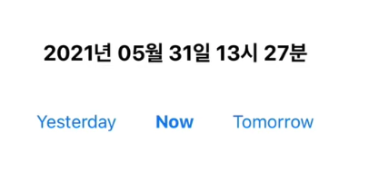
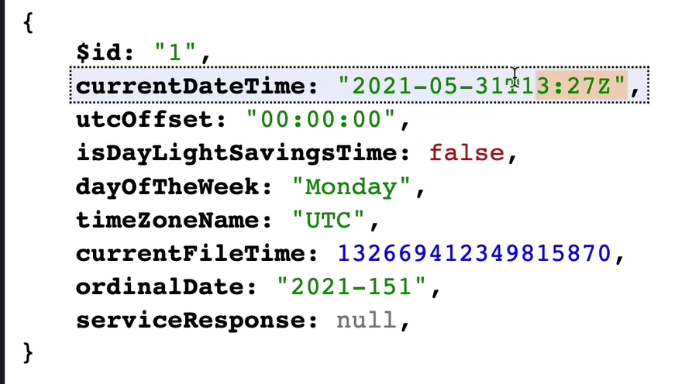

# mvc, mvvm 정리

위의 json data에서 currentDateTime을 화면에 보여주기 위한 단계를 정리해보자.

Json

## -> UtcTimeModel: 원형

서버모델(repository의 entity)

## -> Date: Date 포맷으로 변환

실질적인 Model의 역할

## -> String: 화면에 보여주기 위한 string으로 변환

화면모델(viewModel)

## 일반적으로 형성되는 모델 흐름

Repository -> Entity(Model) -> mapper를 통하여 Model에 매핑 -> Model이 산출되면 해당 모델을 통해 로직을 수행하고 -> 결국 화면에 보여지는건 ViewModel이므로 로직을 통하여 ViewModel이 생기면 해당 viewmodel을 통해 View가 만들어진다.

## mvc mvp mvvm

mvc는 repository에서 entity를 가져오고 해당 엔티티를 통해서 view가 변경되야 하는 작업을 컨트롤러에서 전부처리
mvp는 repository에서 entity를 가져오고 해당 엔티티를 통해서 뷰모델과 해당 뷰모델의 변경에 대한 처리를 전부 presenter에서 처리
mvvm은 repository에서 entity를 가져오고 해당 엔티티를 통해서 뷰모델을 만드는데 이때 뷰모델은 순수 객체고 해당 뷰모델이 업데이트 됐을 때 뷰에서 이를 감지하도록
바인드 객체를 하나 만들어서 데이터가 일관적으로 흐르도록 한다.
